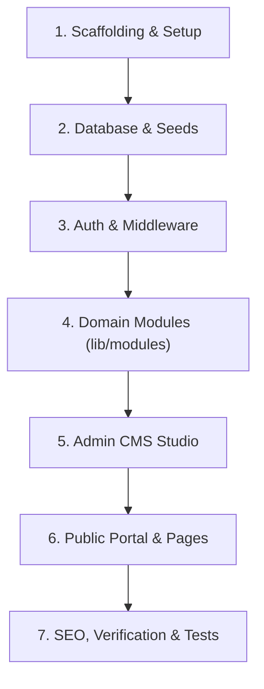

# Implementation Plan: Consultancy Web Portal & Dynamic CMS (Phase 1)

**Spec**: [`docs/superpowers/specs/2026-09-11-consultancy-cms-platform-design.md`](file:///home/crazzy/projects/consultancy-platform/docs/superpowers/specs/2026-09-11-consultancy-cms-platform-design.md)  
**Date**: 2026-09-11  
**Status**: Ready for Execution  

---

## Plan Overview

This plan outlines the complete execution roadmap for building Phase 1 of the consultancy platform. It is structured into seven bite-sized milestones. Each task defines target files, required dependencies, commands to execute, and verifiable acceptance criteria.

---

## Milestone 1: Project Scaffolding & Core Tooling

- [ ] **Task 1.1: Initialize Next.js project with TypeScript & Tailwind CSS**
  - **Directory**: `/home/crazzy/projects/consultancy-platform`
  - **Dependencies**: `next`, `react`, `react-dom`, `typescript`, `@types/react`, `@types/node`, `tailwindcss`, `postcss`, `autoprefixer`, `lucide-react`, `clsx`, `tailwind-merge`, `class-variance-authority`
  - **Command**: Scaffold and configure `tailwind.config.ts`, `postcss.config.js`, `tsconfig.json`.
  - **Verification**: `npm run build` succeeds cleanly.

- [ ] **Task 1.2: Set up Vitest and environment configuration**
  - **Files**: `vitest.config.ts`, `.env.example`, `.env.local`
  - **Dependencies**: `vitest`, `@testing-library/react`, `jsdom`, `dotenv`
  - **Verification**: `npm run test` runs and passes a sample assertion.

---

## Milestone 2: Database Layer & Seed Data

- [ ] **Task 2.1: Prisma ORM configuration & Schema setup**
  - **Files**: `prisma/schema.prisma`, `lib/db/prisma.ts`
  - **Dependencies**: `@prisma/client`, `prisma` (dev)
  - **Models**: `User`, `Article`, `Service`, `CaseStudy`, `Resource`, `Testimonial`, `TeamMember`, `Inquiry`, `MediaAsset`.
  - **Verification**: Run `npx prisma generate` and verify Prisma Client types are generated.

- [ ] **Task 2.2: Database Seeder for Admin and Initial Demo Content**
  - **Files**: `prisma/seed.ts`
  - **Dependencies**: `bcryptjs`, `@types/bcryptjs`
  - **Content**:
    - 1 Default Admin user (`admin@consultancy.com` / hashed password)
    - 3 Consulting Services (e.g., Strategic Advisory, Cloud Architecture, Digital Transformation)
    - 2 Published Articles with rich content
    - 2 Case Studies with JSON metrics
    - 2 Client Testimonials & 2 Team Member profiles
  - **Verification**: Run `npx prisma db seed` (or migration script) and verify database contains records.

---

## Milestone 3: Authentication & Admin Security Guard

- [ ] **Task 3.1: NextAuth / Auth.js Credentials Engine**
  - **Files**: `lib/auth/auth.ts`, `app/api/auth/[...nextauth]/route.ts`
  - **Dependencies**: `next-auth@beta` or `next-auth`, `bcryptjs`
  - **Features**: Credentials provider verifying email and hashed password against `User` table; JWT token enriched with `id` and `role`.
  - **Verification**: Unit test verifying bcrypt password match and session payload generation.

- [ ] **Task 3.2: Middleware Route Guard**
  - **Files**: `middleware.ts`
  - **Logic**:
    - Protect all `/dashboard/*` paths.
    - Redirect unauthenticated sessions to `/login?callbackUrl=/dashboard`.
    - Allow public access to all other routes.
  - **Verification**: Unauthenticated curl to `/dashboard` returns redirect (302/307) to `/login`.

- [ ] **Task 3.3: Admin Login Page**
  - **Files**: `app/(admin)/login/page.tsx`, `components/admin/LoginForm.tsx`
  - **Features**: Clean branded login card, email/password inputs with client validation, error toast for invalid credentials.
  - **Verification**: Submitting correct credentials redirects to `/dashboard`.

---

## Milestone 4: Domain Service Modules (`lib/modules/*`)

- [ ] **Task 4.1: Articles Module (`lib/modules/articles`)**
  - **Files**: `lib/modules/articles/types.ts`, `lib/modules/articles/service.ts`, `lib/modules/articles/actions.ts`
  - **Operations**: `getPublishedArticles`, `getArticleBySlug`, `createArticle`, `updateArticle`, `deleteArticle`, `togglePublishArticle`.
  - **Features**: Auto-slug generation from title, Zod validation, `revalidatePath('/insights')`.
  - **Verification**: Unit tests covering slug collisions and publish cache triggers.

- [ ] **Task 4.2: Services & Case Studies Modules**
  - **Files**: `lib/modules/services/service.ts`, `lib/modules/case-studies/service.ts`
  - **Operations**: CRUD operations, ordering, metrics JSON schema validation.
  - **Verification**: Tests verifying validation rules and query filters.

- [ ] **Task 4.3: Resources & Lead Inquiries Modules**
  - **Files**: `lib/modules/resources/service.ts`, `lib/modules/inquiries/service.ts`
  - **Operations**: Download counter increment, contact form submission Server Action with inquiry status transitions (`NEW` → `CONTACTED` → `QUALIFIED` → `ARCHIVED`).
  - **Verification**: Server Action returns typed success/error responses.

- [ ] **Task 4.4: Media Storage Pipeline**
  - **Files**: `lib/modules/media/storage.ts`, `app/api/upload/route.ts`
  - **Operations**: File size checking (<5MB for images, <25MB for PDFs), MIME type filtering, local disk saving in `/public/uploads` with unique hashes, creation of `MediaAsset` record.
  - **Verification**: Upload test returns asset URL and persists file.

---

## Milestone 5: Admin CMS Studio (`app/(admin)/dashboard/*`)

- [ ] **Task 5.1: Dashboard Layout & Navigation Shell**
  - **Files**: `app/(admin)/dashboard/layout.tsx`, `components/admin/Sidebar.tsx`, `components/admin/Header.tsx`
  - **Features**: Responsive sidebar, active route indicators, unread inquiry badge count, live site shortcut link, sign out button.
  - **Verification**: Navigation transitions seamlessly between all admin sections.

- [ ] **Task 5.2: Overview Dashboard**
  - **Files**: `app/(admin)/dashboard/page.tsx`
  - **Features**: Stat cards (Total Articles, Active Services, Case Studies, New Inquiries), recent leads quick-list.
  - **Verification**: Stats accurately reflect database counts.

- [ ] **Task 5.3: Articles Manager & TipTap Rich Text Editor**
  - **Files**: `app/(admin)/dashboard/articles/page.tsx`, `app/(admin)/dashboard/articles/[id]/page.tsx`, `components/editor/TipTapEditor.tsx`, `components/editor/MediaPickerModal.tsx`
  - **Features**: Article listing table with publish status badges; editor with bold, headings, lists, blockquotes, code, and media library image insertion; SEO preview card.
  - **Verification**: Admin can write an article, upload a cover image, and publish it.

- [ ] **Task 5.4: Management Pages for Services, Case Studies, Resources, Testimonials, & Team**
  - **Files**:
    - `app/(admin)/dashboard/services/*`
    - `app/(admin)/dashboard/case-studies/*`
    - `app/(admin)/dashboard/resources/*`
    - `app/(admin)/dashboard/testimonials/*`
    - `app/(admin)/dashboard/team/*`
  - **Features**: Table lists, creation/edit modals, form fields with validation.
  - **Verification**: Adding, editing, and deleting items correctly mutates PostgreSQL.

- [ ] **Task 5.5: Inquiries & Leads Inbox**
  - **Files**: `app/(admin)/dashboard/inquiries/page.tsx`
  - **Features**: Filterable table of inquiries, status dropdown selector, full message preview modal.
  - **Verification**: Updating status updates badge count immediately.

---

## Milestone 6: Public Consultancy Portal (`app/(public)/*`)

- [ ] **Task 6.1: Public Layout, Header & Footer**
  - **Files**: `app/(public)/layout.tsx`, `components/public/Header.tsx`, `components/public/Footer.tsx`
  - **Features**: Clean typography, responsive mobile menu, consultancy logo, primary CTA button ("Get in Touch" / "Book Consultation").
  - **Verification**: Header and footer render cleanly across mobile and desktop viewports.

- [ ] **Task 6.2: Homepage (`app/(public)/page.tsx`)**
  - **Components**:
    - Hero section with high-impact value proposition and CTA
    - Featured Services grid
    - Case Studies proof section
    - Dynamic Testimonials carousel/grid
    - Latest Insights / Articles preview
    - Bottom conversion banner
  - **Verification**: Homepage fetches and displays live data from Prisma models with zero layout shift.

- [ ] **Task 6.3: Services & Case Studies Pages**
  - **Files**:
    - `app/(public)/services/page.tsx` & `[slug]/page.tsx`
    - `app/(public)/case-studies/page.tsx` & `[slug]/page.tsx`
  - **Features**: Detailed deliverables breakdown, client metric callout boxes, related testimonials.
  - **Verification**: Slugs render dynamically with proper 404 handling for non-existent slugs.

- [ ] **Task 6.4: Insights (Blog) & Resources Hub**
  - **Files**:
    - `app/(public)/insights/page.tsx` & `[slug]/page.tsx`
    - `app/(public)/resources/page.tsx`
  - **Features**: Category filter pills, reading time estimation, rich text renderer for TipTap HTML content, downloadable resource cards with download counter.
  - **Verification**: Reading article content renders styled typography and embedded media.

- [ ] **Task 6.5: Team & Contact/Inquiry Page**
  - **Files**:
    - `app/(public)/team/page.tsx`
    - `app/(public)/contact/page.tsx`, `components/public/ContactForm.tsx`
  - **Features**: Interactive inquiry form with name, email, phone, company, service dropdown, and message; optimistic feedback on submit.
  - **Verification**: Submitting form writes inquiry to database and displays confirmation screen.

---

## Milestone 7: SEO, Boundaries, & Automated Testing

- [ ] **Task 7.1: SEO Metadata & Dynamic OpenGraph Generator**
  - **Files**: `lib/seo/metadata.ts`
  - **Features**: `generateMetadata` on all dynamic routes (`/insights/[slug]`, `/services/[slug]`, `/case-studies/[slug]`), canonical URLs, JSON-LD structured data for Organization and Articles.
  - **Verification**: Inspect generated `<head>` tags to ensure correct OpenGraph and meta descriptions.

- [ ] **Task 7.2: Resilient UI Boundaries**
  - **Files**: `app/not-found.tsx`, `app/error.tsx`
  - **Features**: Polished branded 404 page and graceful error fallback with "Try again" button.
  - **Verification**: Navigating to non-existent route displays custom 404 page.

- [ ] **Task 7.3: End-to-End Smoke Tests (Playwright)**
  - **Files**: `e2e/public-flows.spec.ts`, `e2e/admin-cms.spec.ts`
  - **Tests**:
    1. Public flow: Visitor navigates homepage → clicks service → visits contact → submits inquiry.
    2. Admin flow: Login → create new article → save & publish → verify article appears on public `/insights`.
  - **Verification**: `npx playwright test` passes 100%.
